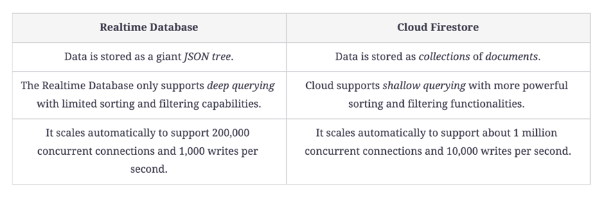

# learn-firebase

https://www.educative.io/courses/complete-guide-firebase-web

- Firebase Authentication
- Firebase Realtime Database
- Cloud Firestore
- Cloud Storage for Firestore
- Firebase CLI
- Cloud Functions
- Environment Variables
- Firebase Security Rules
- Firebase Hosting

### Firestore vs Realtime Database
https://firebase.google.com/docs/database/rtdb-vs-firestore?hl=en
https://stackoverflow.com/questions/46549766/whats-the-difference-between-cloud-firestore-and-the-firebase-realtime-database

1. Cloud Firestore is Firebase's newest database for mobile app development. It builds on the successes of the Realtime Database with a new, more intuitive data model. Cloud Firestore also features richer, faster queries and scales further than the Realtime Database.
2. Realtime Database is Firebase's original database. It's an efficient, low-latency solution for mobile apps that require synced states across clients in realtime.

### Cloud Functions

There are three ways we can call Firebase Cloud Functions directly, each with its unique operation and usage. These methods are as follows:

Schedule a Cloud Function to run at specific times or intervals.
Trigger a function in response to an HTTP request.
Calling a Cloud Function directly from the Firebase App. This means calling it from the client.
